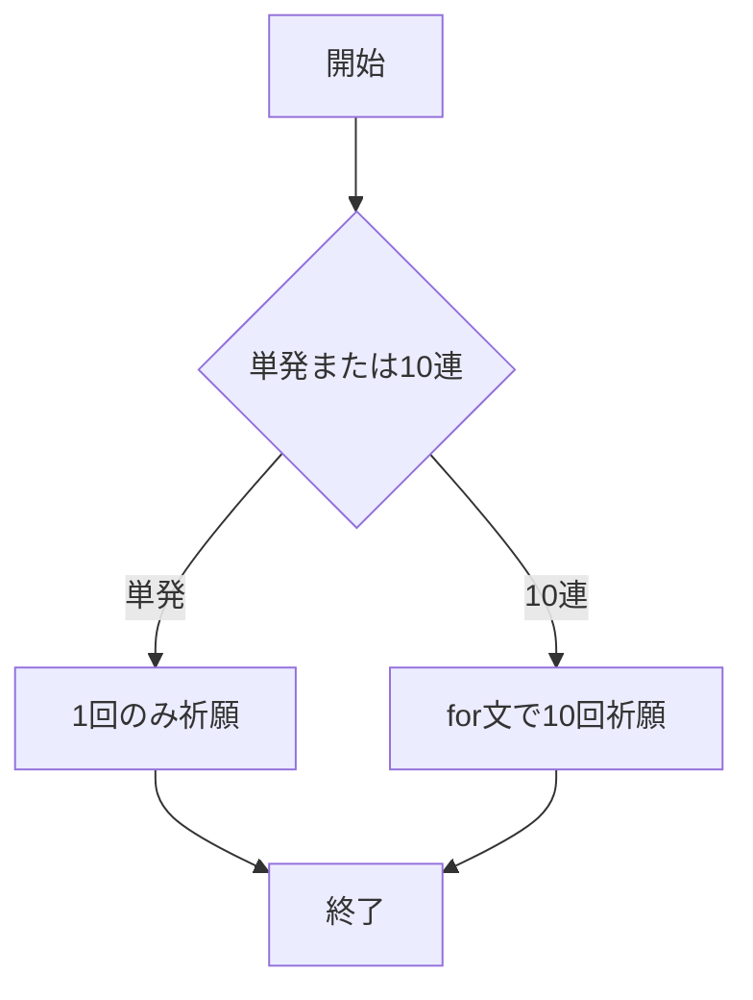

# webpro_06

## このプログラムについて

## ファイル一覧
ファイル名 | 説明
-|-
app5.js | プログラム本体
public/jannken.html | じゃんけん開始画面
public/wish.html | 祈願開始画面
janken.ejs | WEB表記内容
wish.ejs | WEB表記内容

## 起動方法
1. ターミナルにて```node app5.js```でプログラムを起動
1. Webブラウザで
localhost:8080/public/wish.html
にアクセスする
1. 単発または10連を選択する

## 大まかなチャート


## 機能
1. 10回に1度は必ず星4が排出される
1. 90回までに星5は必ず排出される(天井要素)
1. 74回目からは星5の排出確率が6%ずつ増加，代わりに星3の排出確率が減少

## 排出確率
レアリティ |  確率
-|-
星3 | 94.3%
星4 | 5.1%
星5 | 0.6%