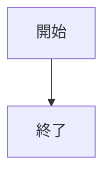
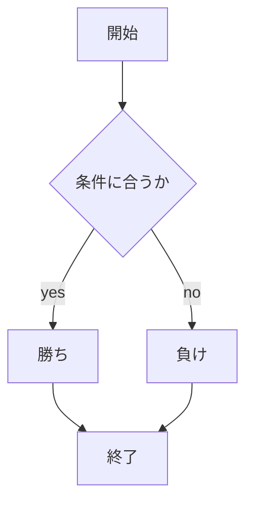

# webpro_06

## このプログラムについて

## ファイル一覧
ファイル名 | 説明
-|-
app5.js | プログラム本体
public/jannken.html | じゃんけん開始画面
janken.ejs | WEB表記内容

```javascript
console.log( 'Hello' );
```

1. ```node app5.js```でプログラムを起動
1. Webブラウザで
ocalhost:8080/public/janken.html
にアクセスする
1. 自分の手を入力する



