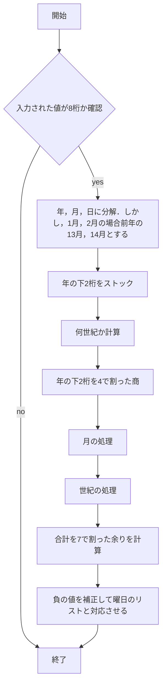

# webpro_06

## ファイル一覧
ファイル名 | 説明
-|-
app5.js | プログラム本体
public/jannken.html | じゃんけん開始画面
public/wish.html | 祈願開始画面
public/zeller.html | 入力画面
janken.ejs | WEB表記内容
wish.ejs | WEB表記内容
zeller.ejs | WEB表記内容

# wishについて
## 起動方法
1. ターミナルにて```node app5.js```でプログラムを起動
1. Webブラウザで
localhost:8080/public/wish.html
にアクセスする
1. 単発または10連を選択する

## 大まかなチャート

#### 祈願内部のフローチャート

*1 ある値は 943-fiveceiling である．fiveceilingは星5の確率上昇及び星3確率減少の処理に使用．
```javascript
num <= 943 - fiveceiling
```
```javascript
fiveceiling = fiveCounter > 73 ? (fiveCounter - 73) * 60 : 0;
```
*2 ある値は 995-fiveceiling である．
```javascript
num >= 995 - fiveceiling
```

## 機能
1. 10回に1度は必ず星4が排出される
1. 90回までに星5は必ず排出される(天井要素)
1. 74回目からは星5の排出確率が6%ずつ増加，代わりに星3の排出確率が減少

## 排出確率
レアリティ |  確率
-|-
星3 | 94.3%
星4 | 5.1%
星5 | 0.6%

# zellerについて
## 起動方法
1. ターミナルにて```node app5.js```でプログラムを起動
1. Webブラウザで
localhost:8080/public/zeller.html
にアクセスする
1. 生年月日入力した後に送信する

## フローチャート


## 機能
好きな年月日の曜日を調べることができる

## 改善点
1. 年月日が存在しなくても8桁であれば計算できてしまう
1. 8桁出ない場合でも終了画面が同じで文言が不可解になってしまう