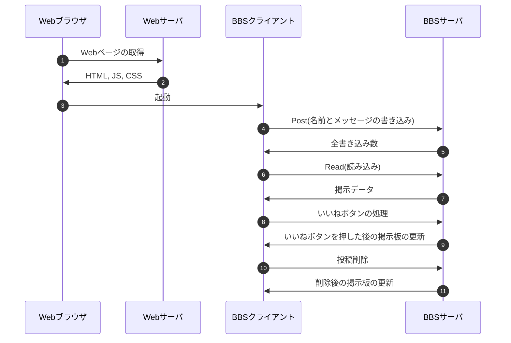

# bbs

```mermaid
sequenceDiagram
  autonumber
  Webブラウザ ->> Webサーバ: Webページの取得
  Webサーバ ->> Webブラウザ:HTML, JS, CSS
  Webブラウザ ->> BBSクライアント:起動
  BBSクライアント ->> BBSサーバ:Post(名前とメッセージの書き込み) 
  BBSサーバ ->> BBSクライアント:全書き込み数
  BBSクライアント ->> BBSサーバ:Read(読み込み)
  BBSサーバ ->> BBSクライアント:掲示データ
  BBSクライアント ->> BBSサーバ:いいねボタンの処理
  BBSサーバ ->> BBSクライアント:いいねボタンを押した後の掲示板の更新
  BBSクライアント ->> BBSサーバ:投稿削除
  BBSサーバ ->> BBSクライアント:削除後の掲示板の更新
```